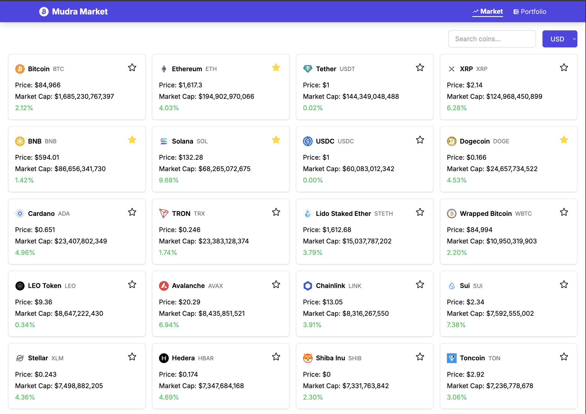

 Mudra Market - Cryptocurrency Tracker 📈💰



Mudra Market is a modern cryptocurrency tracking application built with Next.js, TypeScript, and Tailwind CSS. It provides real-time data on top cryptocurrencies with beautiful visualizations and intuitive navigation.

## Features ✨

- 🚀 **Real-time Crypto Data**: Track top 50 cryptocurrencies by market cap  
- 🔍 **Advanced Search**: Find coins by name or symbol with keyword search  
- 📊 **Detailed Coin Views**: Comprehensive statistics and information for each coin  
- 🎨 **Responsive Design**: Works flawlessly on all devices  
- ⚡ **Performance Optimized**: Fast loading with intelligent data caching  
- 🔒 **Type Safety**: Built with TypeScript for robust development  

## Technologies Used 🛠️

- **Framework**: Next.js (App Router)  
- **Language**: TypeScript  
- **Styling**: Tailwind CSS  
- **State Management**: Redux Toolkit  
- **Icons**: React Icons  
- **Data Fetching**: To be implemented
- **Charting**: To be implemented
- **Testing**: To be implemented

## Getting Started 🏁
### Prerequisites
- Node.js (v18 or higher)   

### Installation
```bash
git clone https://github.com/krupalkkmech/mudra-market.git
cd mudra-market
npm install
npm dev
```
